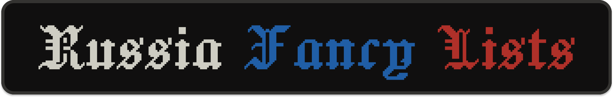

  
  
This repository provides curated, auto-updating lists of domains and resources that are currently restricted or throttled in Russia. Perfect for your home-lab, VPN gateway, or custom routing setup.

  

    <picture><source media="(prefers-color-scheme: dark)" srcset="https://www.shieldcn.dev/github/stars/Noktomezo/RussiaFancyLists.svg?variant=secondary&size=xs&mode=dark&theme=neutral&font=geist-mono"></picture>
    <picture><source media="(prefers-color-scheme: dark)" srcset="https://www.shieldcn.dev/github/last-commit/Noktomezo/RussiaFancyLists.svg?variant=secondary&size=xs&mode=dark&theme=neutral&font=geist-mono"></picture>
    <picture><source media="(prefers-color-scheme: dark)" srcset="https://www.shieldcn.dev/github/commits/Noktomezo/RussiaFancyLists.svg?variant=secondary&size=xs&mode=dark&theme=neutral&font=geist-mono"></picture>
    <picture><source media="(prefers-color-scheme: dark)" srcset="https://www.shieldcn.dev/github/license/Noktomezo/RussiaFancyLists.svg?variant=ghost&size=xs&mode=dark&theme=neutral&font=geist-mono"></picture>
  

  
🇬🇧 <b>English</b> • <a href="README.ru.md">🇷🇺 Русский</a>

## 👀 Content

> [!NOTE]
> 🤖 **Automated Updates**: Lists are updated every 3 hours (including 21:00 UTC / 00:00 GMT+3 — Moscow Standard Time) via GitHub Actions. Only pushes when lists actually change.

Generated artifacts are organized as follows:

<table width="100%">
  <thead>
    <tr>
      <th width="120" align="center"><b>Category</b></th>
      <th width="110" align="center"><b>Variant</b></th>
      <th width="100" align="center"><b>Type</b></th>
      <th width="450" align="center"><b>Files</b></th>
      <th width="220" align="center"><b>Size</b></th>
    </tr>
  </thead>
  <tbody>
    <tr>
      <td rowspan="6"><b>Blacklist</b></td>
      <td rowspan="2"><b>Text</b></td>
      <td><b>Domains</b></td>
      <td>
        • <a href="https://raw.githubusercontent.com/Noktomezo/RussiaFancyLists/main/lists/blacklist/domains/full.lst"><code>full.lst</code></a> 
        • <a href="https://raw.githubusercontent.com/Noktomezo/RussiaFancyLists/main/lists/blacklist/domains/full-sld.lst"><code>full-sld.lst</code></a>
      </td>
      <td>
        • <!-- SIZE:lists/blacklist/domains/full.lst -->27.53 MB<!-- SIZE_END --> 
        • <!-- SIZE:lists/blacklist/domains/full-sld.lst -->19.58 MB<!-- SIZE_END -->
      </td>
    </tr>
    <tr>
      <td><b>IP sets</b></td>
      <td>
        • <a href="https://raw.githubusercontent.com/Noktomezo/RussiaFancyLists/main/lists/blacklist/ipsets/full.lst"><code>full.lst</code></a> 
        • <a href="https://raw.githubusercontent.com/Noktomezo/RussiaFancyLists/main/lists/blacklist/ipsets/full-and-cdn.lst"><code>full-and-cdn.lst</code></a> 
        • <a href="https://raw.githubusercontent.com/Noktomezo/RussiaFancyLists/main/lists/blacklist/ipsets/cdn.lst"><code>cdn.lst</code></a>
      </td>
      <td>
        • <!-- SIZE:lists/blacklist/ipsets/full.lst -->893.4 KB<!-- SIZE_END --> 
        • <!-- SIZE:lists/blacklist/ipsets/full-and-cdn.lst -->565.8 KB<!-- SIZE_END --> 
        • <!-- SIZE:lists/blacklist/ipsets/cdn.lst -->175.8 KB<!-- SIZE_END -->
      </td>
    </tr>
    <tr>
      <td rowspan="2"><b>sing-box</b></td>
      <td><b>Domains</b></td>
      <td>
        • <a href="https://raw.githubusercontent.com/Noktomezo/RussiaFancyLists/main/lists/blacklist-sing-box/domains/full.json"><code>full.json</code></a> 
        • <a href="https://raw.githubusercontent.com/Noktomezo/RussiaFancyLists/main/lists/blacklist-sing-box/domains/full.srs"><code>full.srs</code></a> 
        • <a href="https://raw.githubusercontent.com/Noktomezo/RussiaFancyLists/main/lists/blacklist-sing-box/domains/full-sld.json"><code>full-sld.json</code></a> 
        • <a href="https://raw.githubusercontent.com/Noktomezo/RussiaFancyLists/main/lists/blacklist-sing-box/domains/full-sld.srs"><code>full-sld.srs</code></a>
      </td>
      <td>
        • <!-- SIZE:lists/blacklist-sing-box/domains/full.json -->44.04 MB<!-- SIZE_END --> 
        • <!-- SIZE:lists/blacklist-sing-box/domains/full.srs -->8.87 MB<!-- SIZE_END --> 
        • <!-- SIZE:lists/blacklist-sing-box/domains/full-sld.json -->32.13 MB<!-- SIZE_END --> 
        • <!-- SIZE:lists/blacklist-sing-box/domains/full-sld.srs -->6.73 MB<!-- SIZE_END -->
      </td>
    </tr>
    <tr>
      <td><b>IP sets</b></td>
      <td>
        • <a href="https://raw.githubusercontent.com/Noktomezo/RussiaFancyLists/main/lists/blacklist-sing-box/ipsets/full.json"><code>full.json</code></a> 
        • <a href="https://raw.githubusercontent.com/Noktomezo/RussiaFancyLists/main/lists/blacklist-sing-box/ipsets/full.srs"><code>full.srs</code></a> 
        • <a href="https://raw.githubusercontent.com/Noktomezo/RussiaFancyLists/main/lists/blacklist-sing-box/ipsets/full-and-cdn.json"><code>full-and-cdn.json</code></a> 
        • <a href="https://raw.githubusercontent.com/Noktomezo/RussiaFancyLists/main/lists/blacklist-sing-box/ipsets/full-and-cdn.srs"><code>full-and-cdn.srs</code></a> 
        • <a href="https://raw.githubusercontent.com/Noktomezo/RussiaFancyLists/main/lists/blacklist-sing-box/ipsets/cdn.json"><code>cdn.json</code></a> 
        • <a href="https://raw.githubusercontent.com/Noktomezo/RussiaFancyLists/main/lists/blacklist-sing-box/ipsets/cdn.srs"><code>cdn.srs</code></a>
      </td>
      <td>
        • <!-- SIZE:lists/blacklist-sing-box/ipsets/full.json -->1.45 MB<!-- SIZE_END --> 
        • <!-- SIZE:lists/blacklist-sing-box/ipsets/full.srs -->171.1 KB<!-- SIZE_END --> 
        • <!-- SIZE:lists/blacklist-sing-box/ipsets/full-and-cdn.json -->945.5 KB<!-- SIZE_END --> 
        • <!-- SIZE:lists/blacklist-sing-box/ipsets/full-and-cdn.srs -->125.8 KB<!-- SIZE_END --> 
        • <!-- SIZE:lists/blacklist-sing-box/ipsets/cdn.json -->296.7 KB<!-- SIZE_END --> 
        • <!-- SIZE:lists/blacklist-sing-box/ipsets/cdn.srs -->41.5 KB<!-- SIZE_END -->
      </td>
    </tr>
    <tr>
      <td rowspan="2"><b>Mihomo</b></td>
      <td><b>Domains</b></td>
      <td>
        • <a href="https://raw.githubusercontent.com/Noktomezo/RussiaFancyLists/main/lists/blacklist-mihomo/domains/full.yaml"><code>full.yaml</code></a> 
        • <a href="https://raw.githubusercontent.com/Noktomezo/RussiaFancyLists/main/lists/blacklist-mihomo/domains/full.mrs"><code>full.mrs</code></a> 
        • <a href="https://raw.githubusercontent.com/Noktomezo/RussiaFancyLists/main/lists/blacklist-mihomo/domains/full-sld.yaml"><code>full-sld.yaml</code></a> 
        • <a href="https://raw.githubusercontent.com/Noktomezo/RussiaFancyLists/main/lists/blacklist-mihomo/domains/full-sld.mrs"><code>full-sld.mrs</code></a>
      </td>
      <td>
        • <!-- SIZE:lists/blacklist-mihomo/domains/full.yaml -->36.33 MB<!-- SIZE_END --> 
        • <!-- SIZE:lists/blacklist-mihomo/domains/full.mrs -->8.37 MB<!-- SIZE_END --> 
        • <!-- SIZE:lists/blacklist-mihomo/domains/full-sld.yaml -->26.42 MB<!-- SIZE_END --> 
        • <!-- SIZE:lists/blacklist-mihomo/domains/full-sld.mrs -->6.20 MB<!-- SIZE_END -->
      </td>
    </tr>
    <tr>
      <td><b>IP sets</b></td>
      <td>
        • <a href="https://raw.githubusercontent.com/Noktomezo/RussiaFancyLists/main/lists/blacklist-mihomo/ipsets/full.yaml"><code>full.yaml</code></a> 
        • <a href="https://raw.githubusercontent.com/Noktomezo/RussiaFancyLists/main/lists/blacklist-mihomo/ipsets/full.mrs"><code>full.mrs</code></a> 
        • <a href="https://raw.githubusercontent.com/Noktomezo/RussiaFancyLists/main/lists/blacklist-mihomo/ipsets/full-and-cdn.yaml"><code>full-and-cdn.yaml</code></a> 
        • <a href="https://raw.githubusercontent.com/Noktomezo/RussiaFancyLists/main/lists/blacklist-mihomo/ipsets/full-and-cdn.mrs"><code>full-and-cdn.mrs</code></a> 
        • <a href="https://raw.githubusercontent.com/Noktomezo/RussiaFancyLists/main/lists/blacklist-mihomo/ipsets/cdn.yaml"><code>cdn.yaml</code></a> 
        • <a href="https://raw.githubusercontent.com/Noktomezo/RussiaFancyLists/main/lists/blacklist-mihomo/ipsets/cdn.mrs"><code>cdn.mrs</code></a>
      </td>
      <td>
        • <!-- SIZE:lists/blacklist-mihomo/ipsets/full.yaml -->1.19 MB<!-- SIZE_END --> 
        • <!-- SIZE:lists/blacklist-mihomo/ipsets/full.mrs -->195.7 KB<!-- SIZE_END --> 
        • <!-- SIZE:lists/blacklist-mihomo/ipsets/full-and-cdn.yaml -->772.9 KB<!-- SIZE_END --> 
        • <!-- SIZE:lists/blacklist-mihomo/ipsets/full-and-cdn.mrs -->159.2 KB<!-- SIZE_END --> 
        • <!-- SIZE:lists/blacklist-mihomo/ipsets/cdn.yaml -->241.7 KB<!-- SIZE_END --> 
        • <!-- SIZE:lists/blacklist-mihomo/ipsets/cdn.mrs -->54.8 KB<!-- SIZE_END -->
      </td>
    </tr>
    <tr>
      <td rowspan="6"><b>Geoblock</b></td>
      <td rowspan="2"><b>Text</b></td>
      <td><b>Domains</b></td>
      <td>
        • <a href="https://raw.githubusercontent.com/Noktomezo/RussiaFancyLists/main/lists/geoblock/domains/full.lst"><code>full.lst</code></a> 
        • <a href="https://raw.githubusercontent.com/Noktomezo/RussiaFancyLists/main/lists/geoblock/domains/full-sld.lst"><code>full-sld.lst</code></a>
      </td>
      <td>
        • <!-- SIZE:lists/geoblock/domains/full.lst -->25.5 KB<!-- SIZE_END --> 
        • <!-- SIZE:lists/geoblock/domains/full-sld.lst -->6.5 KB<!-- SIZE_END -->
      </td>
    </tr>
    <tr>
      <td><b>IP sets</b></td>
      <td>
        • <a href="https://raw.githubusercontent.com/Noktomezo/RussiaFancyLists/main/lists/geoblock/ipsets/full.lst"><code>full.lst</code></a>
      </td>
      <td>
        • <!-- SIZE:lists/geoblock/ipsets/full.lst -->25.4 KB<!-- SIZE_END -->
      </td>
    </tr>
    <tr>
      <td rowspan="2"><b>sing-box</b></td>
      <td><b>Domains</b></td>
      <td>
        • <a href="https://raw.githubusercontent.com/Noktomezo/RussiaFancyLists/main/lists/geoblock-sing-box/domains/full.json"><code>full.json</code></a> 
        • <a href="https://raw.githubusercontent.com/Noktomezo/RussiaFancyLists/main/lists/geoblock-sing-box/domains/full.srs"><code>full.srs</code></a> 
        • <a href="https://raw.githubusercontent.com/Noktomezo/RussiaFancyLists/main/lists/geoblock-sing-box/domains/full-sld.json"><code>full-sld.json</code></a> 
        • <a href="https://raw.githubusercontent.com/Noktomezo/RussiaFancyLists/main/lists/geoblock-sing-box/domains/full-sld.srs"><code>full-sld.srs</code></a>
      </td>
      <td>
        • <!-- SIZE:lists/geoblock-sing-box/domains/full.json -->39.9 KB<!-- SIZE_END --> 
        • <!-- SIZE:lists/geoblock-sing-box/domains/full.srs -->9.6 KB<!-- SIZE_END --> 
        • <!-- SIZE:lists/geoblock-sing-box/domains/full-sld.json -->12.2 KB<!-- SIZE_END --> 
        • <!-- SIZE:lists/geoblock-sing-box/domains/full-sld.srs -->3.6 KB<!-- SIZE_END -->
      </td>
    </tr>
    <tr>
      <td><b>IP sets</b></td>
      <td>
        • <a href="https://raw.githubusercontent.com/Noktomezo/RussiaFancyLists/main/lists/geoblock-sing-box/ipsets/full.json"><code>full.json</code></a> 
        • <a href="https://raw.githubusercontent.com/Noktomezo/RussiaFancyLists/main/lists/geoblock-sing-box/ipsets/full.srs"><code>full.srs</code></a>
      </td>
      <td>
        • <!-- SIZE:lists/geoblock-sing-box/ipsets/full.json -->42.2 KB<!-- SIZE_END --> 
        • <!-- SIZE:lists/geoblock-sing-box/ipsets/full.srs -->4.1 KB<!-- SIZE_END -->
      </td>
    </tr>
    <tr>
      <td rowspan="2"><b>Mihomo</b></td>
      <td><b>Domains</b></td>
      <td>
        • <a href="https://raw.githubusercontent.com/Noktomezo/RussiaFancyLists/main/lists/geoblock-mihomo/domains/full.yaml"><code>full.yaml</code></a> 
        • <a href="https://raw.githubusercontent.com/Noktomezo/RussiaFancyLists/main/lists/geoblock-mihomo/domains/full.mrs"><code>full.mrs</code></a> 
        • <a href="https://raw.githubusercontent.com/Noktomezo/RussiaFancyLists/main/lists/geoblock-mihomo/domains/full-sld.yaml"><code>full-sld.yaml</code></a> 
        • <a href="https://raw.githubusercontent.com/Noktomezo/RussiaFancyLists/main/lists/geoblock-mihomo/domains/full-sld.mrs"><code>full-sld.mrs</code></a>
      </td>
      <td>
        • <!-- SIZE:lists/geoblock-mihomo/domains/full.yaml -->33.3 KB<!-- SIZE_END --> 
        • <!-- SIZE:lists/geoblock-mihomo/domains/full.mrs -->9.4 KB<!-- SIZE_END --> 
        • <!-- SIZE:lists/geoblock-mihomo/domains/full-sld.yaml -->9.6 KB<!-- SIZE_END --> 
        • <!-- SIZE:lists/geoblock-mihomo/domains/full-sld.mrs -->3.3 KB<!-- SIZE_END -->
      </td>
    </tr>
    <tr>
      <td><b>IP sets</b></td>
      <td>
        • <a href="https://raw.githubusercontent.com/Noktomezo/RussiaFancyLists/main/lists/geoblock-mihomo/ipsets/full.yaml"><code>full.yaml</code></a> 
        • <a href="https://raw.githubusercontent.com/Noktomezo/RussiaFancyLists/main/lists/geoblock-mihomo/ipsets/full.mrs"><code>full.mrs</code></a>
      </td>
      <td>
        • <!-- SIZE:lists/geoblock-mihomo/ipsets/full.yaml -->34.5 KB<!-- SIZE_END --> 
        • <!-- SIZE:lists/geoblock-mihomo/ipsets/full.mrs -->3.6 KB<!-- SIZE_END -->
      </td>
    </tr>
    <tr>
      <td rowspan="6"><b>Whitelist</b></td>
      <td rowspan="2"><b>Text</b></td>
      <td><b>Domains</b></td>
      <td>
        • <a href="https://raw.githubusercontent.com/Noktomezo/RussiaFancyLists/main/lists/whitelist/domains.lst"><code>domains.lst</code></a>
      </td>
      <td>
        • <!-- SIZE:lists/whitelist/domains.lst -->15.3 KB<!-- SIZE_END -->
      </td>
    </tr>
    <tr>
      <td><b>IP sets</b></td>
      <td>
        • <a href="https://raw.githubusercontent.com/Noktomezo/RussiaFancyLists/main/lists/whitelist/ipset.lst"><code>ipset.lst</code></a> 
        • <a href="https://raw.githubusercontent.com/Noktomezo/RussiaFancyLists/main/lists/whitelist/cidr.lst"><code>cidr.lst</code></a>
      </td>
      <td>
        • <!-- SIZE:lists/whitelist/ipset.lst -->1.68 MB<!-- SIZE_END --> 
        • <!-- SIZE:lists/whitelist/cidr.lst -->459.4 KB<!-- SIZE_END -->
      </td>
    </tr>
    <tr>
      <td rowspan="2"><b>sing-box</b></td>
      <td><b>Domains</b></td>
      <td>
        • <a href="https://raw.githubusercontent.com/Noktomezo/RussiaFancyLists/main/lists/whitelist-sing-box/domains.json"><code>domains.json</code></a> 
        • <a href="https://raw.githubusercontent.com/Noktomezo/RussiaFancyLists/main/lists/whitelist-sing-box/domains.srs"><code>domains.srs</code></a>
      </td>
      <td>
        • <!-- SIZE:lists/whitelist-sing-box/domains.json -->25.2 KB<!-- SIZE_END --> 
        • <!-- SIZE:lists/whitelist-sing-box/domains.srs -->3.8 KB<!-- SIZE_END -->
      </td>
    </tr>
    <tr>
      <td><b>IP sets</b></td>
      <td>
        • <a href="https://raw.githubusercontent.com/Noktomezo/RussiaFancyLists/main/lists/whitelist-sing-box/ipset.json"><code>ipset.json</code></a> 
        • <a href="https://raw.githubusercontent.com/Noktomezo/RussiaFancyLists/main/lists/whitelist-sing-box/ipset.srs"><code>ipset.srs</code></a> 
        • <a href="https://raw.githubusercontent.com/Noktomezo/RussiaFancyLists/main/lists/whitelist-sing-box/cidr.json"><code>cidr.json</code></a> 
        • <a href="https://raw.githubusercontent.com/Noktomezo/RussiaFancyLists/main/lists/whitelist-sing-box/cidr.srs"><code>cidr.srs</code></a>
      </td>
      <td>
        • <!-- SIZE:lists/whitelist-sing-box/ipset.json -->3.16 MB<!-- SIZE_END --> 
        • <!-- SIZE:lists/whitelist-sing-box/ipset.srs -->212.4 KB<!-- SIZE_END --> 
        • <!-- SIZE:lists/whitelist-sing-box/cidr.json -->784.2 KB<!-- SIZE_END --> 
        • <!-- SIZE:lists/whitelist-sing-box/cidr.srs -->73.0 KB<!-- SIZE_END -->
      </td>
    </tr>
    <tr>
      <td rowspan="2"><b>Mihomo</b></td>
      <td><b>Domains</b></td>
      <td>
        • <a href="https://raw.githubusercontent.com/Noktomezo/RussiaFancyLists/main/lists/whitelist-mihomo/domains.yaml"><code>domains.yaml</code></a> 
        • <a href="https://raw.githubusercontent.com/Noktomezo/RussiaFancyLists/main/lists/whitelist-mihomo/domains.mrs"><code>domains.mrs</code></a>
      </td>
      <td>
        • <!-- SIZE:lists/whitelist-mihomo/domains.yaml -->20.6 KB<!-- SIZE_END --> 
        • <!-- SIZE:lists/whitelist-mihomo/domains.mrs -->3.8 KB<!-- SIZE_END -->
      </td>
    </tr>
    <tr>
      <td><b>IP sets</b></td>
      <td>
        • <a href="https://raw.githubusercontent.com/Noktomezo/RussiaFancyLists/main/lists/whitelist-mihomo/ipset.yaml"><code>ipset.yaml</code></a> 
        • <a href="https://raw.githubusercontent.com/Noktomezo/RussiaFancyLists/main/lists/whitelist-mihomo/ipset.mrs"><code>ipset.mrs</code></a> 
        • <a href="https://raw.githubusercontent.com/Noktomezo/RussiaFancyLists/main/lists/whitelist-mihomo/cidr.yaml"><code>cidr.yaml</code></a> 
        • <a href="https://raw.githubusercontent.com/Noktomezo/RussiaFancyLists/main/lists/whitelist-mihomo/cidr.mrs"><code>cidr.mrs</code></a>
      </td>
      <td>
        • <!-- SIZE:lists/whitelist-mihomo/ipset.yaml -->2.89 MB<!-- SIZE_END --> 
        • <!-- SIZE:lists/whitelist-mihomo/ipset.mrs -->155.5 KB<!-- SIZE_END --> 
        • <!-- SIZE:lists/whitelist-mihomo/cidr.yaml -->636.5 KB<!-- SIZE_END --> 
        • <!-- SIZE:lists/whitelist-mihomo/cidr.mrs -->86.2 KB<!-- SIZE_END -->
      </td>
    </tr>
  </tbody>
</table>

## 🖥️ Hosts Files

Direct hosts file mappings for domain unblocking and proxy routing:

<!-- HOSTS_TABLE_START -->
<table>
  <thead>
    <tr>
      <th>File</th>
      <th>Size</th>
      <th>Description</th>
    </tr>
  </thead>
  <tbody>
    <tr>
      <td><a href="https://raw.githubusercontent.com/Noktomezo/RussiaFancyLists/main/lists/hosts/combined.hosts"><code>combined.hosts</code></a></td>
      <td><!-- SIZE:lists/hosts/combined.hosts -->229.0 KB<!-- SIZE_END --></td>
      <td><b>Recommended:</b> Full unified list (Geoblocks + Crutches)</td>
    </tr>
    <tr>
      <td><a href="https://raw.githubusercontent.com/Noktomezo/RussiaFancyLists/main/lists/hosts/combined-no-crutch.hosts"><code>combined-no-crutch.hosts</code></a></td>
      <td><!-- SIZE:lists/hosts/combined-no-crutch.hosts -->221.7 KB<!-- SIZE_END --></td>
      <td>Unified list without direct IP crutches (for VPN users)</td>
    </tr>
    <tr>
      <td><a href="https://raw.githubusercontent.com/Noktomezo/RussiaFancyLists/main/lists/hosts/only-crutch.hosts"><code>only-crutch.hosts</code></a></td>
      <td><!-- SIZE:lists/hosts/only-crutch.hosts -->7.5 KB<!-- SIZE_END --></td>
      <td>Only direct IP crutch mappings</td>
    </tr>
    <tr>
      <td><a href="https://raw.githubusercontent.com/Noktomezo/RussiaFancyLists/main/lists/hosts/geohide.hosts"><code>geohide.hosts</code></a> / <a href="https://raw.githubusercontent.com/Noktomezo/RussiaFancyLists/main/lists/hosts/geohide-no-crutch.hosts"><code>no-crutch</code></a></td>
      <td><!-- SIZE:lists/hosts/geohide.hosts -->39.1 KB<!-- SIZE_END --> / <!-- SIZE:lists/hosts/geohide-no-crutch.hosts -->31.8 KB<!-- SIZE_END --></td>
      <td>GeoHide DNS proxy endpoints</td>
    </tr>
    <tr>
      <td><a href="https://raw.githubusercontent.com/Noktomezo/RussiaFancyLists/main/lists/hosts/malw.hosts"><code>malw.hosts</code></a> / <a href="https://raw.githubusercontent.com/Noktomezo/RussiaFancyLists/main/lists/hosts/malw-no-crutch.hosts"><code>no-crutch</code></a></td>
      <td><!-- SIZE:lists/hosts/malw.hosts -->39.1 KB<!-- SIZE_END --> / <!-- SIZE:lists/hosts/malw-no-crutch.hosts -->31.8 KB<!-- SIZE_END --></td>
      <td>ImMALWARE DNS proxy endpoints</td>
    </tr>
    <tr>
      <td><a href="https://raw.githubusercontent.com/Noktomezo/RussiaFancyLists/main/lists/hosts/mafioznik.hosts"><code>mafioznik.hosts</code></a> / <a href="https://raw.githubusercontent.com/Noktomezo/RussiaFancyLists/main/lists/hosts/mafioznik-no-crutch.hosts"><code>no-crutch</code></a></td>
      <td><!-- SIZE:lists/hosts/mafioznik.hosts -->11.5 KB<!-- SIZE_END --> / <!-- SIZE:lists/hosts/mafioznik-no-crutch.hosts -->4.1 KB<!-- SIZE_END --></td>
      <td>Mafioznik DNS proxy endpoints</td>
    </tr>
    <tr>
      <td><a href="https://raw.githubusercontent.com/Noktomezo/RussiaFancyLists/main/lists/hosts/stressozz.hosts"><code>stressozz.hosts</code></a> / <a href="https://raw.githubusercontent.com/Noktomezo/RussiaFancyLists/main/lists/hosts/stressozz-no-crutch.hosts"><code>no-crutch</code></a></td>
      <td><!-- SIZE:lists/hosts/stressozz.hosts -->39.4 KB<!-- SIZE_END --> / <!-- SIZE:lists/hosts/stressozz-no-crutch.hosts -->32.0 KB<!-- SIZE_END --></td>
      <td>StressOzz Zapret-Manager proxy endpoints</td>
    </tr>
  </tbody>
</table>
<!-- HOSTS_TABLE_END -->

> [!TIP]
> **💡 Hosts File Options:** 
> 🔄 **`combined.hosts`**: Includes both geoblocks (distributed across all active SNI proxies for automatic failover) and crutches (recommended). 
> 🩹 **What is a "Crutch"?:** A workaround mapping a domain directly to an unblocked IP in its subnet (e.g., CDN/edge servers for GitHub) to bypass local censorship directly, bypassing general SNI proxies. 
> 🌐 **`-no-crutch.hosts`**: Excludes the `# Crutch` section. Useful if you route all other traffic through a VPN. 
> ⚡ **`only-crutch.hosts`**: Contains **only** custom direct IP mappings (crutches). Useful if you route geoblocks via VPN but want to bypass local blocks for specific domains directly.

## ⚡ SNI-Proxy Status
<!-- STATUS_START -->
- **Malw**: 💚💚💚
- **GeoHide**: 💚💚💚
- **Mafioznik**: 💚
- **StressOzz**: 💚

> [!NOTE]
> Each heart represents a distinct active proxy server IP (💚).
<!-- STATUS_END -->

## 🔗 Sources

💜 [Antifilter Domain List](https://antifilter.download/list/domains.lst) — blocked domains from antifilter.download 
💜 [Antifilter Community Domain List](https://community.antifilter.download/list/domains.lst) — community-contributed domain list 
💜 [Re:filter Domain List](https://raw.githubusercontent.com/1andrevich/Re-filter-lists/refs/heads/main/domains_all.lst) — comprehensive domestic blocklist alternative 
💜 [Antifilter IPSet](https://antifilter.download/list/allyouneed.lst) — full set of blocked IP subnets 
💜 [Antifilter Community IPSet](https://community.antifilter.download/list/community.lst) — community-managed blocked IP subnets 
💜 [Antifilter Extra IPSet](https://antifilter.download/list/ipresolve.lst) — resolved IPs of blocked services 
💜 [Re:filter IPSet](https://github.com/1andrevich/Re-filter-lists/raw/refs/heads/main/ipsum.lst) — compiled IP subnet blocklists 
💜 [ImMALWARE's Hosts](https://raw.githubusercontent.com/ImMALWARE/dns.malw.link/refs/heads/master/hosts) — public SNI proxy endpoints from ImMALWARE 
💜 [Mafioznik's Hosts](https://freedom.mafioznik.xyz/file/hosts) — public SNI proxy endpoints from Mafioznik 
💜 [GeoHide's Hosts](https://raw.githubusercontent.com/Internet-Helper/GeoHideDNS/refs/heads/main/hosts/hosts) — public SNI proxy endpoints from GeoHide 
💜 [ItDogInfo's Geoblock Domains](https://raw.githubusercontent.com/itdoginfo/allow-domains/refs/heads/main/Categories/geoblock.lst) — domain blocklists by itdog.info 
💜 [Zapret-Manager Shell Script](https://raw.githubusercontent.com/StressOzz/Zapret-Manager/refs/heads/main/Zapret-Manager.sh) — parsed variables for various restricted services 
💜 [CDN IP Ranges](https://raw.githubusercontent.com/123jjck/cdn-ip-ranges/refs/heads/main/all/all_plain_ipv4.txt) — IP address ranges of global CDNs 
💜 [CDN IP Database](https://raw.githubusercontent.com/mansourjabin/cdn-ip-database/refs/heads/main/data/cdn.lst) — database of global CDN IP ranges 
💜 [dnsx](https://github.com/projectdiscovery/dnsx) — DNS resolution and probing tool by ProjectDiscovery (stored in `thirdparty/dnsx`) 
💜 [sing-box](https://github.com/SagerNet/sing-box) — universal proxy platform core by SagerNet (stored in `thirdparty/sing-box`) 
💜 [mihomo](https://github.com/MetaCubeX/mihomo) — Clash core successor by MetaCubeX (stored in `thirdparty/mihomo`)

&nbsp;

  
  
Made with 💜. Published under <a href="LICENSE">MIT license</a>.

